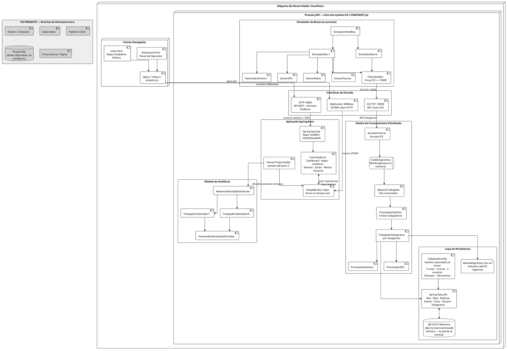

# sitm-mio-distributed-system

Sistema distribuido para monitoreo en tiempo real, procesamiento de eventos y análisis operativo de la red de transporte SITM-MIO, usando ZeroC ICE y patrones de arquitectura distribuida.

---

## Inicio rápido

```bash
cd sitm-mio-system
./gradlew clean build -x test
java -jar build/libs/sitm-mio-system-0.0.1-SNAPSHOT.jar
```

| Interfaz | URL |
|---|---|
| Panel operador | http://localhost:8080/dashboard.html |
| Mapa ciudadano | http://localhost:8080/index.html |
| API REST | http://localhost:8080/api/ |
| Consola H2 | http://localhost:8080/h2-console |
| WebSocket | ws://localhost:8080/ws |
| ICE RPC (buses) | tcp://localhost:10000 |

Credenciales de desarrollo (sembradas automáticamente):

| Usuario | Contraseña | Rol |
|---|---|---|
| admin | admin123 | ADMIN |
| controlador1 | ctrl123 | CONTROLADOR — Zona Norte |
| controlador2 | ctrl123 | CONTROLADOR — Zona Sur |

---

## Arquitectura de despliegue



---

## Puertos

| Puerto | Protocolo | Propósito |
|---|---|---|
| 8080 | HTTP / WS | Dashboard, API REST, archivos estáticos |
| 10000 | TCP (ICE) | Recepción de datagramas desde buses |

## Configuración

Copia `.env.example` como `.env` y ajusta los valores antes de correr en producción. Las propiedades activas están en `sitm-mio-system/src/main/resources/application.properties`.

## Stack tecnológico

| Capa | Tecnología |
|---|---|
| Framework | Spring Boot 3.x |
| Lenguaje | Java 17 |
| Build | Gradle 8 |
| RPC distribuido | ZeroC ICE 3.7 |
| Base de datos (dev) | H2 en memoria |
| Base de datos (prod) | PostgreSQL (disponible, sin configurar) |
| Tiempo real | WebSocket + STOMP |
| Seguridad | Spring Security (BCrypt) |
| Frontend | HTML5 + JS vanilla + Thymeleaf |
